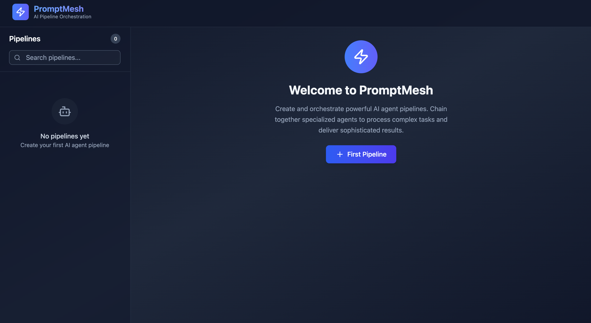

# PromptMesh

A modern AI agent pipeline platform with a **stateless server** and **client-side configuration**.



## Architecture

* **Frontend (React + IndexedDB)** – Stores pipeline configs, agent settings, and user data.
* **Backend (Go)** – Handles temporary pipeline execution sessions only.
* **Stateless Server** – No persistent storage; all data stays client-side.

## Features

* 🤖 Chain multiple AI agents
* 🔧 Visual pipeline builder
* 🔄 Real-time monitoring for debugging
* 🎯 Multi-provider support: OpenAI, Anthropic, Google AI, Cohere, Hugging Face

## Quick Start

### Prerequisites

* Go 1.24.3+ – Required for backend development
* Node.js 24.1.0+ – Required for frontend (React) development
* API keys – Needed to run pipelines with AI providers

### Setup

```bash
git clone https://github.com/yourusername/PromptMesh.git
cd PromptMesh

# Set API keys
export OPENAI_API_KEY="..."
export ANTHROPIC_API_KEY="..."
export GOOGLE_API_KEY="..."
export COHERE_API_KEY="..."
export HUGGINGFACEHUB_API_TOKEN="..."

# Start backend
go mod tidy
go run main.go

# Start frontend
cd dashboard
npm install
npm run dev
```

Open `http://localhost:3000` in your browser.

## API

* `POST /pipelines/execute` – Run a pipeline and get the result
* `POST /pipelines/execute/stream` – Run with live SSE updates

See [API docs](dashboard/src/api/api.md) for details.

## Project Structure

```
PromptMesh/
├── agents/        # AI agent implementations
├── dashboard/     # React frontend
├── orchestration/ # Pipeline logic
├── server/        # Go backend
├── shared/        # Utilities and constants
└── main.go        # Backend entry
```

## Development

* **Frontend:** `cd dashboard && npm install && npm run dev`
* **Backend:** `go mod tidy && go run main.go`
* **Tests:** `go test ./...` (backend), `npm test` (frontend)

## Contributing

1. Fork → feature branch → commit → push → Pull Request

## License

[GNU AGPL-3.0](LICENSE) © 2025 Alexsander Hamir
