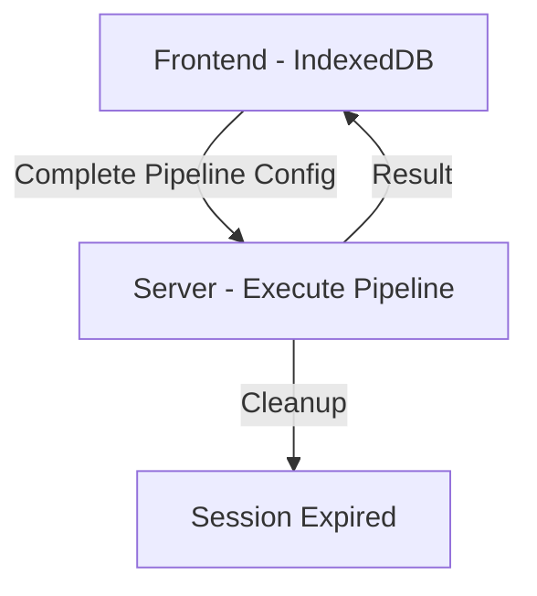
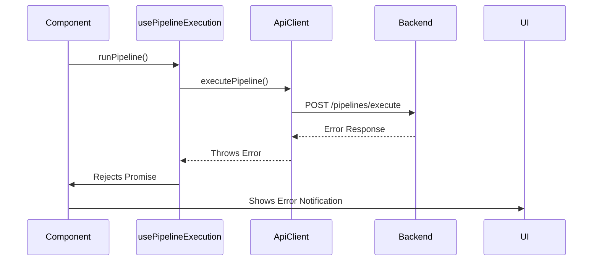

# API Documentation

## Overview

The PromptMesh API is designed as a **stateless execution engine**. The server does not store persistent pipeline configurations - all pipeline and agent configurations are managed by the frontend using IndexedDB. The server only handles pipeline execution through a single endpoint.

## Architecture



## Base URL

- **Development**: `/api` (proxied through Vite)
- **Production**: `REACT_APP_API_URL` environment variable
- **Fallback**: `http://localhost:8080`

## Endpoints

### `POST /pipelines/execute`

- **Purpose**: Executes a complete pipeline with all configuration provided in a single request
- **Parameters**:
  - `name`: Pipeline name (for logging purposes)
  - `firstPrompt`: Initial user prompt
  - `agents`: Array of agent configurations
- **Used in**: Pipeline execution
- **Payload**:
  ```json
  {
    "name": "Marketing Pipeline",
    "first_prompt": "Create social media posts...",
    "agents": [
      {
        "name": "Content Generator",
        "role": "Writer",
        "system_msg": "You are a creative writer...",
        "provider": "openai",
        "model": "gpt-4"
      },
      {
        "name": "Editor",
        "role": "Reviewer",
        "system_msg": "You are an editor...",
        "provider": "anthropic",
        "model": "claude-3-sonnet"
      }
    ]
  }
  ```
- **Response**:
  ```json
  {
    "result": "Generated and edited social media content...",
    "message": "Pipeline 'Marketing Pipeline' executed successfully"
  }
  ```

## Environment Configuration

| Environment | API Base URL     | Configuration Method |
| ----------- | ---------------- | -------------------- |
| Development | `/api`           | Vite proxy           |
| Production  | Custom URL       | `REACT_APP_API_URL`  |
| Fallback    | `localhost:8080` | Hardcoded default    |

## Stateless Design Benefits

1. **No Persistent Storage**: Server doesn't store pipeline configurations
2. **Single Request**: Complete pipeline execution in one API call
3. **Frontend Control**: All pipeline management happens in the frontend
4. **Scalability**: Server can handle multiple concurrent executions without state conflicts
5. **Simplicity**: Minimal server complexity with single responsibility

## Error Handling Architecture



## Usage Best Practices

1. **Always await** API calls within try/catch blocks
2. **Consume errors** from both API and execution layers
3. **Validate configuration** before sending to server
4. **Store results in frontend** - server doesn't persist execution results
5. **Use IndexedDB** for all persistent pipeline configurations

## Execution Flow

1. **Frontend** retrieves pipeline configuration from IndexedDB
2. **Frontend** sends complete configuration to server in single request
3. **Server** creates agents, executes pipeline, and returns results
4. **Frontend** saves results to IndexedDB
5. **Server** automatically cleans up execution session after 1 hour
