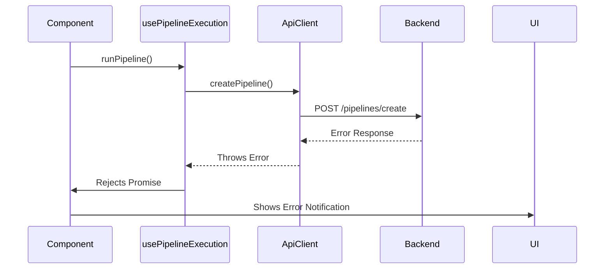

# API Client Documentation (`client.js`)

## Overview

The `ApiClient` class provides a centralized interface for all backend API communications in the PromptMesh application. It's designed to:

- Handle all HTTP requests consistently
- Manage API base URL configuration
- Standardize error handling
- Provide pipeline-specific methods

## Key Implementation Details

```javascript
const API_BASE_URL =
  process.env.NODE_ENV === "development"
    ? "/api"  // Uses Vite proxy in development
    : process.env.REACT_APP_API_URL || "http://localhost:8080";

class ApiClient {
  async request(endpoint, options = {}) {
    // Core request handling with error management
  }

  // Pipeline operations
  async createPipeline(name, firstPrompt) { ... }
  async addAgentToPipeline(pipelineId, agent) { ... }
  async startPipeline(pipelineId) { ... }
}

export const apiClient = new ApiClient();
```

## Integration Points

### 1. Used by `usePipelineExecution` Hook

The hook consumes all three API methods during pipeline execution:

```javascript
// In usePipelineExecution.js
const runPipeline = async (pipelineForm, agents) => {
  // 1. Create pipeline
  const createResult = await apiClient.createPipeline(
    pipelineForm.name,
    pipelineForm.firstPrompt
  );

  // 2. Add all agents
  for (const agent of agents) {
    await apiClient.addAgentToPipeline(createResult.pipeline_id, agent);
  }

  // 3. Execute pipeline
  const executionResult = await apiClient.startPipeline(
    createResult.pipeline_id
  );
};
```

### 2. Error Handling Flow

The client implements a standardized error handling pattern:

1. Checks for HTTP errors (non-2xx responses)
2. Attempts to parse error messages from response
3. Throws consistent Error objects
4. Logs errors to console

This flows up to the hook which:

- Captures errors in execution logs
- Provides visual feedback through the UI
- Preserves execution state

## API Methods

### `createPipeline(name, firstPrompt)`

- **Purpose**: Initializes a new pipeline
- **Parameters**:
  - `name`: Pipeline name
  - `firstPrompt`: Initial user prompt
- **Used in**: First step of pipeline execution
- **Payload**:
  ```json
  {
    "name": "Marketing Pipeline",
    "first_prompt": "Create social media posts..."
  }
  ```

### `addAgentToPipeline(pipelineId, agent)`

- **Purpose**: Adds an agent to existing pipeline
- **Parameters**:
  - `pipelineId`: ID from createPipeline response
  - `agent`: Full agent configuration object
- **Used in**: Agent configuration phase
- **Payload**:
  ```json
  {
    "pipeline_id": "pipe_123",
    "name": "Content Generator",
    "role": "Writer",
    "system_msg": "You are a creative writer...",
    "provider": "openai",
    "model": "gpt-4"
  }
  ```

### `startPipeline(pipelineId)`

- **Purpose**: Executes the configured pipeline
- **Parameters**: `pipelineId` - ID of pipeline to execute
- **Used in**: Final execution phase
- **Returns**: Pipeline execution results

## Environment Configuration

| Environment | API Base URL     | Configuration Method |
| ----------- | ---------------- | -------------------- |
| Development | `/api`           | Vite proxy           |
| Production  | Custom URL       | `REACT_APP_API_URL`  |
| Fallback    | `localhost:8080` | Hardcoded default    |

## Error Handling Architecture



## Usage Best Practices

1. **Always await** API calls within try/catch blocks
2. **Consume errors** from both API and execution layers
3. **Use the singleton instance** (`apiClient`) rather than creating new instances
4. **Extend carefully** - Add new methods following the same pattern:
   ```javascript
   async newEndpoint(params) {
     return this.request("/new-endpoint", {
       method: "POST",
       body: JSON.stringify(params)
     });
   }
   ```

This documentation shows how the API client serves as the critical bridge between the frontend application and backend services, enabling the complex pipeline operations while maintaining clean separation of concerns.
