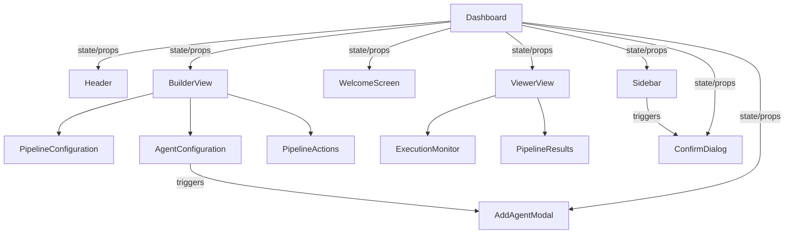

# PromptMesh Component Hierarchy Documentation

## Application Structure Overview

```
Dashboard (Root Component)
├── Header
├── Sidebar
└── Main Content (Dynamic)
    ├── WelcomeScreen
    ├── Builder View
    │   ├── PipelineConfiguration
    │   ├── AgentConfiguration
    │   └── PipelineActions
    └── Viewer View
        ├── ExecutionMonitor
        └── PipelineResults
└── Modals
    ├── AddAgentModal
    └── ConfirmDialog
```

## Component Relationships

### 1. Root Component: `Dashboard.jsx`

- **Role**: Main application container and state manager
- **Child Components**:
  - `Header`
  - `Sidebar`
  - Dynamic main content area (switches between views)
  - Modal dialogs (`AddAgentModal`, `ConfirmDialog`)

### 2. Persistent Layout Components

#### `Header.jsx`

- **Position**: Fixed top
- **Props**:
  - `onCreateNewPipeline`: From Dashboard
- **Features**:
  - Branding
  - Global "New Pipeline" action

#### `Sidebar.jsx`

- **Position**: Left side
- **Props**:
  - `pipelines`: From Dashboard state
  - `currentPipeline`: From Dashboard state
  - `onSelectPipeline`: Calls Dashboard's `handleSelectPipeline`
  - `onDeletePipeline`: Calls Dashboard's `handleDeletePipeline`
- **Features**:
  - Pipeline list navigation
  - Pipeline status indicators
  - Delete functionality

### 3. Main Content Views

#### `WelcomeScreen.jsx`

- **Displayed When**: No pipeline selected (`currentView === "welcome"`)
- **Props**:
  - `onCreateNewPipeline`: From Dashboard
  - `hasExistingPipelines`: Derived from Dashboard's pipelines state

#### Builder View (`currentView === "builder"`)

- **Components**:

  1. `PipelineConfiguration.jsx`

     - Manages pipeline name and initial prompt
     - Props:
       - `pipelineForm`: From Dashboard state
       - `onFormChange`: Calls Dashboard's `handleFormChange`
       - `errors`: From Dashboard state

  2. `AgentConfiguration.jsx`

     - Manages agent list
     - Props:
       - `agents`: From Dashboard state
       - `errors`: From Dashboard state
       - Various handlers from Dashboard (`onShowAddAgent`, `onEditAgent`, etc.)

  3. `PipelineActions.jsx`
     - Provides action buttons
     - Props:
       - Various state flags from Dashboard (`isRunning`, `isFormValid`, etc.)
       - Action handlers from Dashboard (`onRunPipeline`, `onSavePipeline`, etc.)

#### Viewer View (`currentView === "viewer"`)

- **Components**:

  1. `ExecutionMonitor.jsx`

     - Shows real-time execution progress
     - Props:
       - `progress`: From Dashboard's execution hook
       - `logs`: From Dashboard's execution hook

  2. `PipelineResults.jsx`
     - Displays execution output
     - Props:
       - `result`: From Dashboard's execution hook or currentPipeline
       - `isFromPreviousExecution`: Derived prop
       - `lastExecutionDate`: From currentPipeline

### 4. Modal Components

#### `AddAgentModal.jsx`

- **Triggered By**: "Add Agent" button in `AgentConfiguration`
- **Props**:
  - `showModal`: From Dashboard state
  - `agentForm`: From Dashboard state
  - `isEditing`: From Dashboard state
  - Various handlers from Dashboard

#### `ConfirmDialog.jsx`

- **Triggered By**: Pipeline delete action in `Sidebar`
- **Props**:
  - Dialog configuration from Dashboard
  - Confirmation/cancel handlers

## Data Flow Diagram

**Note**: To view the interactive diagram:

- Copy the Mermaid code below to [Mermaid Live Editor](https://mermaid.live/).
- Or use a Markdown editor with Mermaid support (VS Code, Obsidian, etc.).



## Key State Management Points

1. **Pipeline Data**:

   - Managed in Dashboard component
   - Persisted to localStorage via custom hook
   - Shared with Sidebar and builder/view components

2. **Form State**:

   - Pipeline form and agent form managed separately
   - Validation errors centralized in Dashboard

3. **Execution State**:

   - Managed by `usePipelineExecution` hook
   - Shared with ExecutionMonitor and PipelineResults

4. **UI State**:
   - Current view (welcome/builder/viewer)
   - Modal visibility
   - Editing states

## Component Communication Patterns

1. **Parent-Child**:

   - Dashboard passes state and handlers down to children
   - Children communicate up via handler props

2. **Sibling**:

   - Components communicate through shared parent state
   - Example: AgentConfiguration triggers AddAgentModal via Dashboard state

3. **Cross-View**:
   - Execution results flow from ExecutionMonitor to PipelineResults via Dashboard

This hierarchical structure provides a clear separation of concerns while maintaining centralized state management in the Dashboard component, ensuring consistent data flow throughout the application.
