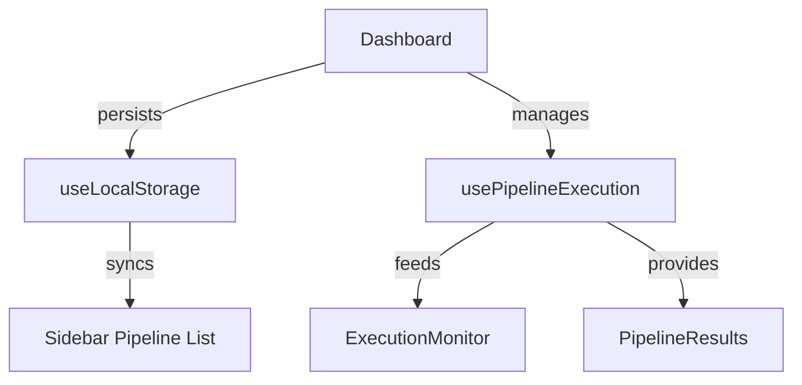

# Custom Hooks Documentation

## Overview

The application uses two main custom hooks for state management and pipeline execution:

1. `useIndexedDB` - Persists state to IndexedDB for large data storage
2. `usePipelineExecution` - Manages pipeline execution workflow

## Hook 1: `useIndexedDB.js`

### Purpose

Persists React state to IndexedDB and synchronizes changes. Designed for storing large data like prompts that may exceed localStorage limits.

### Implementation

```javascript
import { useState, useEffect, useCallback } from "react";

export const useIndexedDB = (key, initialValue) => {
  const [storedValue, setStoredValue] = useState(initialValue);
  const [isLoading, setIsLoading] = useState(true);
  const [error, setError] = useState(null);

  // Load initial value from IndexedDB
  useEffect(() => {
    const loadValue = async () => {
      try {
        setIsLoading(true);
        setError(null);
        const item = await getFromDB(key);
        setStoredValue(item !== null ? item : initialValue);
      } catch (err) {
        console.error(`Error reading IndexedDB key "${key}":`, err);
        setError(err);
        setStoredValue(initialValue);
      } finally {
        setIsLoading(false);
      }
    };

    loadValue();
  }, [key, initialValue]);

  // Update IndexedDB when state changes
  const setValue = useCallback(
    async (value) => {
      try {
        setError(null);
        const valueToStore =
          value instanceof Function ? value(storedValue) : value;
        setStoredValue(valueToStore);

        if (valueToStore === undefined) {
          await removeFromDB(key);
        } else {
          await setInDB(key, valueToStore);
        }
      } catch (err) {
        console.error(`Error setting IndexedDB key "${key}":`, err);
        setError(err);
      }
    },
    [key, storedValue]
  );

  // Remove from IndexedDB
  const removeValue = useCallback(async () => {
    try {
      setError(null);
      await removeFromDB(key);
      setStoredValue(initialValue);
    } catch (err) {
      console.error(`Error removing IndexedDB key "${key}":`, err);
      setError(err);
    }
  }, [key, initialValue]);

  return [storedValue, setValue, removeValue, isLoading, error];
};
```

### Usage in Dashboard

```javascript
// Storing pipelines with loading and error states
const [pipelines, setPipelines, , isLoadingPipelines, pipelinesError] =
  useIndexedDB("promptmesh_pipelines", []);
```

### Key Features

1. **Automatic Synchronization**: Any state changes automatically update IndexedDB
2. **Error Handling**: Gracefully falls back to initial value if IndexedDB access fails
3. **Full API**: Provides get, set, and remove operations
4. **Type Preservation**: Handles both direct values and functional updates like useState
5. **Loading States**: Provides loading and error states for better UX
6. **Large Data Support**: Handles large data like prompts that exceed localStorage limits

### Benefits

- Persists pipeline data across page refreshes
- Maintains React's declarative programming model
- Provides clean abstraction over IndexedDB operations
- Supports large prompt data storage
- Includes execution logs for debugging and analysis

---

## Hook 2: `usePipelineExecution.js`

### Purpose

Manages the complete lifecycle of pipeline execution including:

- Progress tracking
- Log generation
- Result handling
- Error management

### Implementation Highlights

```javascript
export const usePipelineExecution = () => {
  // State management
  const [isRunning, setIsRunning] = useState(false);
  const [logs, setLogs] = useState([]);
  const [result, setResult] = useState("");
  const [progress, setProgress] = useState(0);

  // Logging utility
  const addLog = useCallback((type, message) => {
    const timestamp = new Date().toLocaleTimeString();
    setLogs((prev) => [...prev, { type, message, timestamp }]);
  }, []);

  // Core execution function
  const runPipeline = useCallback(async (pipelineForm, agents) => {
    setIsRunning(true);
    resetState();

    try {
      // Pipeline creation
      addLog(LOG_TYPES.INFO, "🚀 Creating pipeline...");
      const createResult = await apiClient.createPipeline(...);

      // Agent addition
      for (const agent of agents) {
        addLog(LOG_TYPES.INFO, `Adding agent ${agent.name}...`);
        await apiClient.addAgentToPipeline(...);
      }

      // Execution
      addLog(LOG_TYPES.INFO, "Starting execution...");
      const executionResult = await apiClient.startPipeline(...);

      // Completion
      setResult(executionResult.result);
      return executionResult.result;

    } catch (error) {
      addLog(LOG_TYPES.ERROR, `Failed: ${error.message}`);
      throw error;
    } finally {
      setIsRunning(false);
    }
  }, [addLog]);

  // Reset function
  const resetExecution = useCallback(() => {
    setLogs([]);
    setResult("");
    setProgress(0);
    setIsRunning(false);
  }, []);

  return {
    isRunning,
    logs,
    result,
    progress,
    runPipeline,
    resetExecution
  };
};
```

### Usage in Dashboard

```javascript
const { isRunning, logs, result, progress, runPipeline, resetExecution } =
  usePipelineExecution();

// Trigger execution
const handleRunPipeline = async () => {
  try {
    const result = await runPipeline(pipelineForm, agents);
    // Save results to pipeline
  } catch (error) {
    // Handle error
  }
};
```

### Execution Phases

1. **Initialization** (0-5% progress)

   - Clears previous state
   - Creates pipeline via API

2. **Agent Configuration** (20-80% progress)

   - Sequentially adds each agent
   - Progress updates proportionally

3. **Execution** (85-100% progress)
   - Runs the complete pipeline
   - Captures final result

### Error Handling

- Catches and logs errors at each stage
- Preserves error messages in execution logs
- Re-throws errors for component-level handling

### Integration Points

- **ExecutionMonitor**: Consumes `logs` and `progress`
- **PipelineResults**: Displays `result` and saved logs
- **PipelineActions**: Uses `isRunning` to disable buttons
- **Dashboard**: Saves execution logs to pipeline data for persistence

### Log Persistence

Execution logs are now automatically saved with each pipeline execution:

- **Successful executions**: Logs are saved alongside the result
- **Failed executions**: Logs are saved alongside the error message
- **Historical access**: Previous execution logs can be viewed when revisiting results
- **Reset functionality**: Logs are cleared when pipeline status is reset

---

## Combined Data Flow

- Copy the Mermaid code below to [Mermaid Live Editor](https://mermaid.live/).
- Or use a Markdown editor with Mermaid support (VS Code, Obsidian, etc.).



### Key Architectural Benefits

1. **Separation of Concerns**: Business logic isolated from components
2. **Reusability**: Hooks can be used across multiple components
3. **Testability**: Independent unit testing of complex logic
4. **Predictable State**: Centralized management of critical operations

---

## Error Handling Strategy

| Hook                   | Error Cases                        | Handling Approach                                           |
| ---------------------- | ---------------------------------- | ----------------------------------------------------------- |
| `useLocalStorage`      | - Quota exceeded<br>- Invalid JSON | - Falls back to initial value<br>- Logs to console          |
| `usePipelineExecution` | - API failures<br>- Network errors | - Detailed error logs<br>- Visual feedback<br>- State reset |
